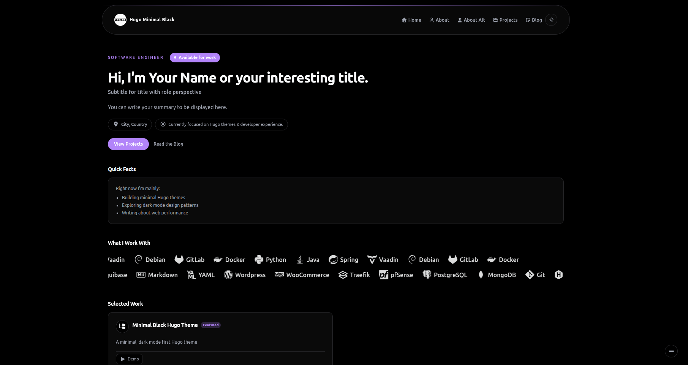
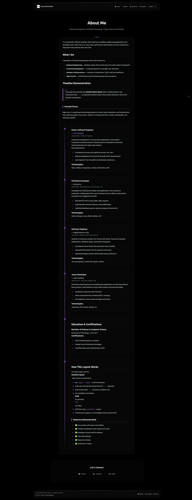
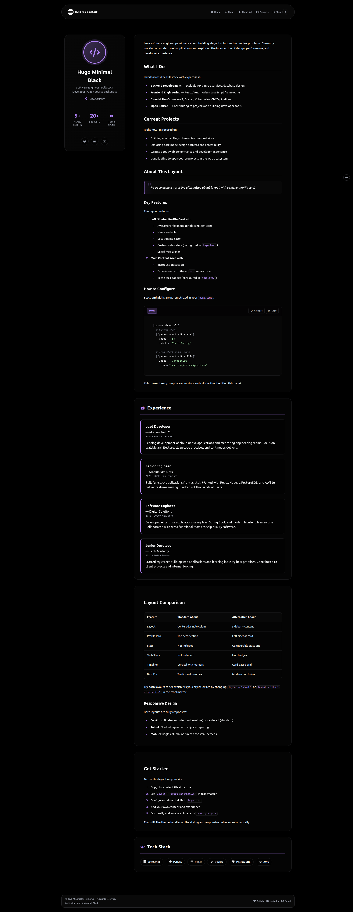
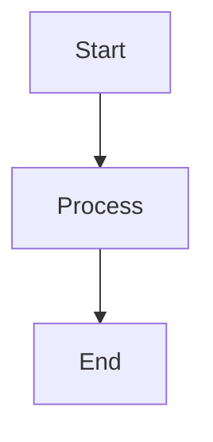

# Minimal Black

A minimal, dark-mode first Hugo theme with true black backgrounds, purple accents, and comprehensive content styling. Perfect for developers, writers and everyone in general who want a clean, fast, and beautiful personal site.


## Features

- ✨ **Dark & Light Mode** — Auto-switching themes with manual toggle
- 🎨 **True Black Dark Mode** — OLED-friendly with purple (`#a855f7`) accents
- 📱 **Fully Responsive** — Mobile-first design that works on all devices
- 🔍 **Built-in Search** — Fast client-side search with keyboard shortcuts (Ctrl/Cmd+K)
- 📑 **Table of Contents** — Auto-generated TOC for blog posts with active section tracking
- 💻 **Beautiful Code Blocks** — Syntax highlighting with copy button and language labels
- 🎯 **Multiple Layouts** — Home, blog, projects, and two about page variants
- 📊 **Mermaid Diagrams** — Native support for flowcharts and diagrams
- 🖼️ **Image Gallery** — Gallery shortcode with lightbox functionality
- 🏷️ **GitHub-Style Alerts** — Support for note, tip, warning, danger, and important callouts
- 📈 **Analytics Ready** — Built-in support for Google Analytics, Plausible, Umami, and Fathom
- ⚡ **Performance Optimized** — Minimal JavaScript, CSS, and fast load times
- 🎭 **Icon Support** — Font Awesome and Devicon integration

## Demo

**Live Demo:** [minimal-black-demo.netlify.app](https://minimal-black-demo.netlify.app)

## Quick Start

### Prerequisites

- Hugo Extended v0.120.0 or higher
- Node.js and npm (for Tailwind CSS compilation)

### Installation

1. **Create a new Hugo site** (or use existing):
   ```bash
   hugo new site my-site
   cd my-site
   ```

2. **Install the theme** using Git submodule:
   ```bash
   git init
   git submodule add https://gitlab.com/jimchr12/hugo-minimal-black.git themes/minimal-black
   ```

   Or clone it directly:
   ```bash
   git clone https://gitlab.com/jimchr12/hugo-minimal-black.git themes/minimal-black
   ```

3. **Install Node dependencies** (for Tailwind CSS):
   ```bash
   cd themes/minimal-black
   npm install
   cd ../..
   ```

4. **Configure your site** — Copy the example configuration:
   ```bash
   cp themes/minimal-black/exampleSite/hugo.toml ./hugo.toml
   ```

5. **Start Hugo server**:
   ```bash
   hugo server -D
   ```

6. **Visit** `http://localhost:1313` in your browser.

## Configuration

### Basic Configuration

Edit your `hugo.toml` file:

```toml
baseURL = 'https://yoursite.com/'
languageCode = 'en-us'
title = 'Your Name'
theme = 'minimal-black'

[params]
  brand = "Your Name"

  # Favicon (place files in /static/)
  favicon = "favicon.svg"
  appleTouchIcon = "apple-touch-icon.png"

  # Theme Configuration
  [params.theme]
    defaultTheme = "dark"  # "light", "dark", or "system"

  # Hero Section
  [params.hero]
    badge = "Software Engineer"
    title = "Hi, I'm Your Name."
    role = "Building minimal, fast web experiences."
    summary = "Brief description of what you do."
    avatar = "images/avatar.jpg"  # Optional
    location = "City, Country"

    [params.hero.primary]
      label = "View projects"
      href = "/projects/"

    [params.hero.secondary]
      label = "Read the blog"
      href = "/blog/"

  # Social Links
  [[params.social]]
    label = "GitHub"
    url = "https://github.com/yourusername"
    icon = "fa-brands fa-github"

  [[params.social]]
    label = "LinkedIn"
    url = "https://linkedin.com/in/yourusername"
    icon = "fa-brands fa-linkedin-in"

[menu]
  [[menu.main]]
    name = "Home"
    url = "/"
    weight = 1

  [[menu.main]]
    name = "About"
    url = "/about/"
    weight = 2

  [[menu.main]]
    name = "Projects"
    url = "/projects/"
    weight = 3

  [[menu.main]]
    name = "Blog"
    url = "/blog/"
    weight = 4

[markup]
  [markup.tableOfContents]
    startLevel = 2
    endLevel = 4

  [markup.goldmark.renderer]
    unsafe = true

  [markup.highlight]
    codeFences = true
    guessSyntax = true
    style = "monokai"
```

### Advanced Configuration

#### Analytics

Google Analytics (GA4):
```toml
[params.analytics]
  googleAnalytics = "G-XXXXXXXXXX"
```

Plausible Analytics:
```toml
[params.analytics.plausible]
  enabled = true
  domain = "yourdomain.com"
```

Umami Analytics:
```toml
[params.analytics.umami]
  enabled = true
  scriptUrl = "https://analytics.yourdomain.com/script.js"
  websiteId = "your-website-id"
```

#### Technology Stack Display

Show your tech stack on the home page:
```toml
[params.home]
  [[params.home.tech]]
    label = "Python"
    icon = "devicon-python-plain"

  [[params.home.tech]]
    label = "Docker"
    icon = "devicon-docker-plain"
```

#### About Page Customization

For the alternative about page layout:
```toml
[params.about.alt]
  # Stats in profile card
  [[params.about.alt.stats]]
    value = "5+"
    label = "Years Coding"

  [[params.about.alt.stats]]
    value = "20+"
    label = "Projects"

  # Skills with icons
  [[params.about.alt.skills]]
    label = "JavaScript"
    icon = "devicon-javascript-plain"
```

## Content Organization

### Creating Content

**Blog Post:**
```bash
hugo new blog/my-first-post.md
```

```markdown
+++
title = "My First Post"
date = "2025-01-01"
author = "Your Name"
tags = ["hugo", "web development"]
categories = ["tutorials"]
draft = false
+++

Your content here...
```

**Project:**
```bash
hugo new projects/my-project.md
```

```markdown
+++
title = "My Project"
date = "2025-01-01"
description = "Brief project description"
github = "https://github.com/username/project"
demo = "https://project-demo.com"
tags = ["react", "typescript"]
featured = true
+++

Project details...
```

### About Page

Create `content/about.md`:

```markdown
+++
title = "About Me"
subtitle = "Software Engineer | Open Source Contributor"
layout = "about"  # or "about-alternative"
+++

Your introduction here.

---

**Job Title** — [Company](https://company.com)
*Dates • Location*

Description of role...

---

**Another Role** — Company
*Dates • Location*

Description...
```

The `---` separators create timeline entries in the standard about layout, or experience cards in the alternative layout.

## Shortcodes

### Gallery

Create image galleries with lightbox:

```markdown





```

### Alert

Create GitHub-style callouts:

```markdown

This is a note alert.



This is a warning alert.

```

Available types: `note`, `tip`, `important`, `warning`, `danger`

### Mermaid Diagrams

````markdown

````

## Customization

### Colors

Theme colors are defined in `assets/css/base.css`:

```css
:root {
  --color-bg: #f9fafb;        /* Light background */
  --color-accent: #a855f7;     /* Purple accent */
}

html[data-theme="dark"] {
  --color-bg: #000000;         /* True black */
  --color-accent: #c084fc;     /* Lighter purple */
}
```

### CSS Architecture

The theme uses a modular CSS structure:

```
assets/css/
├── main.css           # Imports all modules
├── base.css           # Tailwind & variables
├── utilities.css      # Utility classes
├── components/        # Reusable components
├── content/           # Content styling
├── pages/             # Page-specific styles
└── responsive.css     # Media queries
```

See [CSS-STRUCTURE.md](CSS-STRUCTURE.md) for details.

### Adding Custom CSS

Create `assets/css/custom.css` in your site root and import it in your config:

```toml
[params]
  customCSS = ["css/custom.css"]
```

## Deployment

### Netlify

1. Push your site to GitHub
2. Connect to Netlify
3. Build command: `hugo --minify`
4. Publish directory: `public`
5. Environment variables:
   ```
   HUGO_VERSION = 0.120.0
   NODE_VERSION = 18
   ```

## Browser Support

- Chrome/Edge (last 2 versions)
- Firefox (last 2 versions)
- Safari (last 2 versions)
- Mobile browsers (iOS Safari, Chrome Mobile)

## Troubleshooting

### CSS not loading

Ensure Tailwind dependencies are installed:
```bash
cd themes/minimal-black
npm install
```

Also ensure css is compiled:
```bash
npx tailwindcss -i ./assets/css/main.css -o ./static/css/main.css
```

### Search not working

Check that `[outputs]` includes JSON in `hugo.toml`:
```toml
[outputs]
  home = ["HTML", "RSS", "JSON"]
```

### Icons not showing

Verify icon library is enabled:
```toml
[params.icons]
  useFontAwesome = true
  useDevicon = true
```

## Contributing

Contributions are welcome! Please see [CONTRIBUTING.md](CONTRIBUTING.md) for guidelines.

1. Fork the repository
2. Create a feature branch
3. Make your changes
4. Submit a pull request

## License

This theme is released under the MIT License. See [LICENSE](LICENSE) for details.

## Credits

- Built with [Hugo](https://gohugo.io/)
- Styled with [Tailwind CSS](https://tailwindcss.com/)
- Icons from [Font Awesome](https://fontawesome.com/) and [Devicon](https://devicon.dev/)
- Typography plugin by [@tailwindcss/typography](https://github.com/tailwindlabs/tailwindcss-typography)

## Changelog

See [CHANGELOG.md](CHANGELOG.md) for version history and updates.

---

**Made with ❤️ by [Jim Christopoulos](https://jimchristopoulos.com/)**

If you find this theme useful, consider giving it a ⭐ and/or supporting its development!

[](https://ko-fi.com/jimchr)
