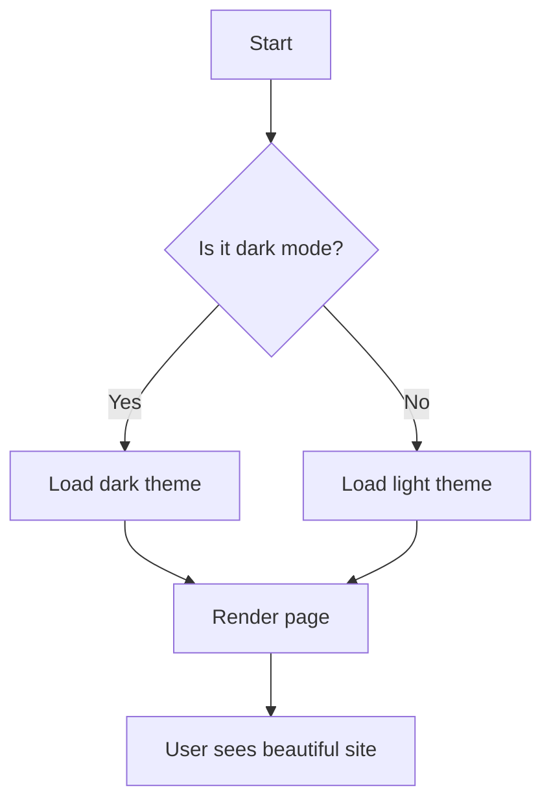
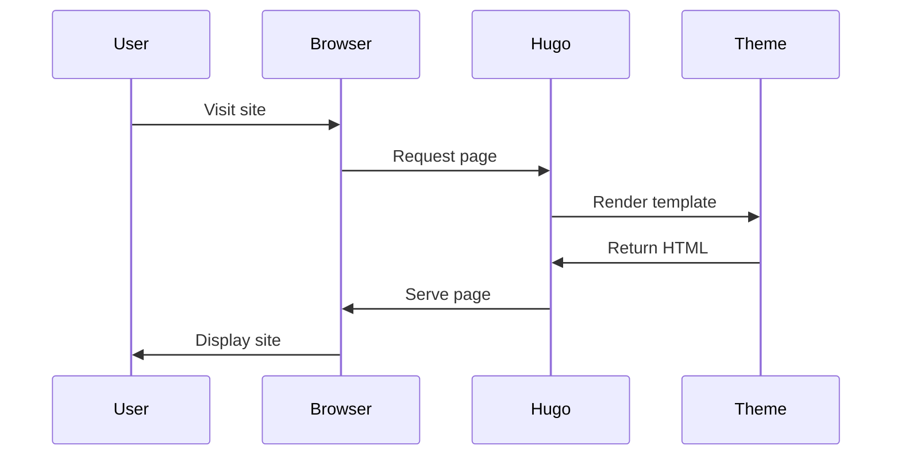
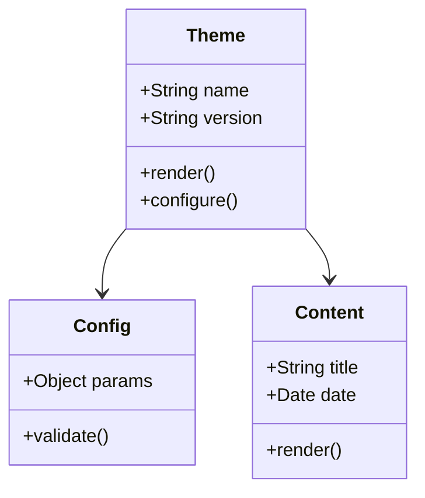

+++
title = "Complete Guide to Minimal Black Theme"
date = "2025-01-15"
author = "Jim Christopoulos"
tags = ["hugo", "tutorial", "guide", "theme"]
categories = ["documentation"]
description = "A comprehensive guide to all features and capabilities of the Minimal Black Hugo theme"
draft = false
+++

Welcome to the complete guide for the Minimal Black Hugo theme! 

This post demonstrates all the features, components, and customization options available in the theme.

## Introduction

Minimal Black is designed for developers, designers, and everybody who want a clean, fast, and beautiful personal website. 

This guide will walk you through every feature with examples you can use in your own content.

## Typography & Text Formatting

### Headings

The theme supports all six heading levels with proper hierarchy and spacing:

# Heading 1
## Heading 2
### Heading 3
#### Heading 4
##### Heading 5
###### Heading 6

Each heading automatically gets an anchor link (hover to see the # symbol) for easy linking.

### Text Emphasis

Use standard Markdown for text formatting:

- **Bold text** for emphasis
- *Italic text* for subtle emphasis
- ***Bold and italic*** for strong emphasis
- ~~Strikethrough~~ for deleted content
- `Inline code` for code references

You can also ==highlight text== using the mark syntax (if enabled in your config).

### Links

Links are styled with subtle hover effects:

- [External link](https://example.com)
  
## Lists

### Unordered Lists

Simple bullet lists:

- First item
- Second item
  - Nested item 1
  - Nested item 2
    - Deeply nested item
- Third item

### Ordered Lists

Numbered lists:

1. First step
2. Second step
   1. Sub-step A
   2. Sub-step B
3. Third step

### Task Lists

Interactive checkboxes:

- [x] Completed task
- [x] Another completed item
- [ ] Pending task
- [ ] Another pending item
  - [x] Nested completed
  - [ ] Nested pending

Task lists are great for project planning, feature tracking, or tutorial steps.

### Definition Lists

For glossary-style content:

Hugo
: A fast static site generator written in Go

Markdown
: A lightweight markup language for formatting text

Tailwind CSS
: A utility-first CSS framework

## Blockquotes

### Standard Blockquotes

Simple quotes with gradient background:

> This is a standard blockquote. It has a subtle gradient background and a colored left border for visual distinction.

> Multi-paragraph blockquotes work too.
>
> They maintain proper spacing between paragraphs while keeping the unified look.

### Nested Blockquotes

You can nest quotes:

> This is the outer quote.
>
> > This is a nested quote inside.
> >
> > > You can nest multiple levels.

### GitHub-Style Alerts

The theme supports GitHub-flavored alert callouts:

> [!NOTE]
> This is a note callout. Use it for informational content that readers should be aware of.

> [!TIP]
> This is a tip callout. Perfect for helpful suggestions and best practices.

> [!IMPORTANT]
> This is an important callout. Use it for critical information that must not be missed.

> [!WARNING]
> This is a warning callout. Great for cautionary information and potential pitfalls.

> [!CAUTION]
> This is a caution callout. Use for dangerous actions or critical warnings.

## Code Blocks

### Inline Code

Reference code inline with `backticks`. 

Great for mentioning `variables`, `functions()`, or `file-names.txt`.

### Basic Code Blocks

Simple code blocks without syntax highlighting:

```
This is a plain code block.
No syntax highlighting.
Perfect for plain text or output.
```

### Syntax Highlighted Code

The theme supports syntax highlighting for dozens of languages:

**JavaScript:**
```javascript

const greet = (name) => {
  console.log(`Hello, ${name}!`);
  return `Welcome to the Minimal Black theme`;
};

// Async/await example
async function fetchData(url) {
  try {
    const response = await fetch(url);
    const data = await response.json();
    return data;
  } catch (error) {
    console.error('Error fetching data:', error);
  }
}
```

**Python:**
```python
def fibonacci(n):
    """Calculate fibonacci number recursively."""
    if n <= 1:
        return n
    return fibonacci(n-1) + fibonacci(n-2)

# List comprehension example
squares = [x**2 for x in range(10)]
print(squares)
```

**Go:**
```go
package main

import "fmt"

func main() {
    // Simple HTTP server
    http.HandleFunc("/", func(w http.ResponseWriter, r *http.Request) {
        fmt.Fprintf(w, "Hello, World!")
    })
    
    http.ListenAndServe(":8080", nil)
}
```

**Bash:**
```bash
#!/bin/bash

# Deploy script
hugo --minify
rsync -avz public/ user@server:/var/www/
echo "Deployment complete!"
```

**CSS:**
```css
/* Dark theme variables */
:root {
  --color-bg: #000000;
  --color-accent: #c084fc;
  --transition: all 0.2s ease;
}

.button {
  background: var(--color-accent);
  transition: var(--transition);
}
```

**HTML:**
```html
<!DOCTYPE html>
<html lang="en">
<head>
  <meta charset="UTF-8">
  <title>Minimal Black</title>
</head>
<body>
  <h1>Welcome!</h1>
</body>
</html>
```

### Code Block Features

All code blocks include:

- **Language Label** — Shows the language in top-right corner
- **Copy Button** — Click to copy code to clipboard
- **Line Numbers** — Optional (configure in hugo.toml)
- **Syntax Highlighting** — Powered by Hugo's Chroma

## Tables

### Basic Tables

| Feature | Supported | Notes |
|---------|-----------|-------|
| Dark Mode | ✅ | True black backgrounds |
| Search | ✅ | Client-side, fast |
| TOC | ✅ | Auto-generated |
| Analytics | ✅ | Multiple providers |

### Aligned Columns

| Left Aligned | Center Aligned | Right Aligned |
|:-------------|:--------------:|--------------:|
| Left | Center | Right |
| Text | Text | 100 |
| More | Data | 250 |

### Complex Tables

| Language | Supported | Syntax Highlighting | Code Blocks |
|----------|:---------:|:-------------------:|-------------|
| JavaScript | ✅ | ✅ | Yes |
| Python | ✅ | ✅ | Yes |
| Go | ✅ | ✅ | Yes |
| Rust | ✅ | ✅ | Yes |
| TypeScript | ✅ | ✅ | Yes |

Tables are responsive and scroll horizontally on small screens.

## Images

### Basic Image


### Image with Caption

Images automatically get a lightbox overlay on hover (magnifying glass icon appears).

### Multiple Images


> [!NOTE]
> *Stock Images obtained from pexels.com*

Images are responsive and scale to fit the content width.

## Gallery Shortcode

Use the gallery shortcode for image collections:






The gallery includes:
- Lightbox functionality
- Click to view full size
- Navigate between images
- Responsive grid layout

## Mermaid Diagrams

### Flowchart



### Sequence Diagram



### Class Diagram



## Horizontal Rules

Separate sections with horizontal rules:

---

Like this one above. They create clear visual breaks in content.

## Footnotes

You can add footnotes[^1] to your content. They appear at the bottom of the page[^2].

[^1]: This is a footnote. It provides additional context without interrupting the flow.
[^2]: Footnotes are automatically numbered and linked.

## Shortcodes

### Alert Shortcode

Use the alert shortcode for callouts:


This is a custom alert using the shortcode syntax. It's an alternative to GitHub-style alerts.



Warning alerts grab attention for important notices.


## Table of Contents

This page demonstrates the automatic table of contents:

- **Desktop:** TOC appears in left sidebar
- **Tablet:** TOC is hidden for more reading space
- **Mobile:** TOC is completely hidden

The TOC automatically:
- Tracks your scroll position
- Highlights the current section
- Links to all headings (H2-H4)
- Stays visible while scrolling (sticky)

## Dark & Light Mode

The theme supports both dark and light modes:

### Dark Mode (Default)
- True black backgrounds (#000000)
- OLED-friendly
- Purple accents (#c084fc)
- Reduced eye strain in low light

### Light Mode
- Clean white backgrounds
- High contrast for daylight reading
- Purple accents (#a855f7)
- Print-friendly

### System Mode
- Automatically matches OS preference
- Respects user's system settings
- Seamless switching

Users can toggle between modes using the theme switcher in the navigation.

## Search Functionality

Press **Ctrl/Cmd + K** to try the search:

1. Type your query
2. Results appear instantly
3. Use arrow keys to navigate
4. Press Enter to visit page
5. ESC to close

The search:
- Is client-side (no server needed)
- Searches titles and summaries
- Highlights matching text
- Works offline

## Navigation

The theme includes:

### Header Navigation
- Logo/brand name
- Main menu links
- Theme toggle

### Footer
- Copyright notice
- Social links
- Attribution

### Floating Dock (Bottom Right)
- Quick actions
- Scroll to top

## Responsive Design

The theme is fully responsive:

### Mobile (< 640px)
- Single column layout
- Collapsible menu
- Touch-friendly buttons
- Optimized images

### Tablet (641px - 1023px)
- Two column where appropriate
- Adjusted spacing
- Tablet-optimized navigation

### Desktop (1024px+)
- Full layout with TOC sidebar
- Wider content area
- Hover effects
- Keyboard shortcuts

## Performance

The theme is optimized for performance:

- **Minimal JavaScript**
- **Optimized CSS**
- **Fast Loading**
- **SEO Optimized** — Meta tags, structured data

## Customization Examples

### Changing Accent Color

Edit `assets/css/base.css`:

```css
:root {
  --color-accent: #10b981; /* Green instead of purple */
}
```

### Adding Custom Fonts

In your `hugo.toml`:

```toml
[params]
  customFonts = ["https://fonts.googleapis.com/css2?family=Inter:wght@400;600;700&display=swap"]
```

### Custom CSS

Create `assets/css/custom.css`:

```css
.my-custom-element {
  /* Your styles */
}
```

## Best Practices

### Content Organization

1. Use clear, descriptive titles
2. Break content into sections with headings
3. Add tags and categories
4. Include descriptions in frontmatter
5. Use featured images for posts

### Performance

1. Optimize images before uploading
2. Use SVG for logos and icons
3. Minimize custom JavaScript
4. Leverage Hugo's asset pipeline

### SEO

1. Write descriptive meta descriptions
2. Use semantic HTML headings
3. Add alt text to images
4. Create an XML sitemap
5. Submit to search engines

## Conclusion

This guide covered all major features of the Minimal Black theme. You now know how to:

- ✅ Format text and create rich content
- ✅ Use code blocks with syntax highlighting
- ✅ Add images and galleries
- ✅ Create diagrams with Mermaid
- ✅ Organize content with TOC
- ✅ Customize colors and styles
- ✅ Optimize for performance
- ✅ Make content SEO-friendly

Start creating amazing content with Minimal Black!

---

**Documentation:** [Full Docs](https://gitlab.com/jimchr12/hugo-minimal-black)

**Repository:** [GitLab](https://gitlab.com/jimchr12/hugo-minimal-black)

**Issues:** [Report a Bug](https://gitlab.com/jimchr12/hugo-minimal-black/issues)
