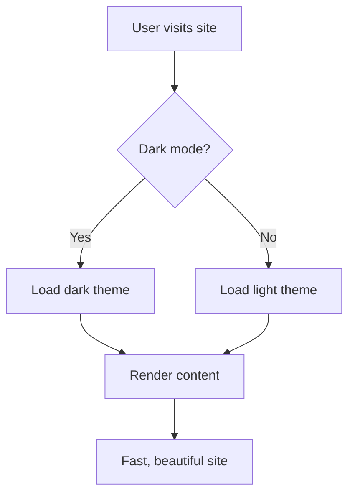

+++
title = "Minimal Black Hugo Theme"
date = "2025-01-15"
description = "A minimal, dark-mode first Hugo theme"
github = "https://gitlab.com/jimchr12/hugo-minimal-black"
demo = "https://minimal-black-demo.netlify.app"
tags = ["hugo", "theme", "web-development", "open-source"]
categories = ["web"]
featured = true
+++

A comprehensive Hugo theme designed for developers, designers, and everyone in general who value simplicity, performance, and beautiful dare I say dark mode design (maybe?).

## Overview

Minimal Black is a modern Hugo theme that combines aesthetic appeal with practical functionality. 

Built with Tailwind CSS and a modular architecture, it provides everything you need for a professional personal website, portfolio or blog.

### Key Features

- **True Black Dark Mode** — With purple accents
- **Responsive Design** — Perfect on mobile, tablet, and desktop
- **Search Functionality** — Fast client-side search with Ctrl/Cmd+K
- **Table of Contents** — Auto-generated
- **Syntax Highlighting** — Beautiful code blocks with copy functionality
- **Multiple Layouts** — Flexible page templates for different content types (more to come hopefully). 

## Technical Architecture

### Frontend Stack

- **Hugo Extended** (v0.120.0+) — Static site generator
- **Tailwind CSS** — Utility-first CSS framework
- **Vanilla JS** — Minimal JS used - no framework
- **PostCSS** — CSS processing and optimization

### CSS Modular Structure

The CSS is organized into logical modules:

```
assets/css/
├── base.css          # Theme variables & Tailwind
├── utilities.css     # Helper classes
├── components/       # Reusable UI components
│   ├── dock.css
│   ├── cards.css
│   ├── navigation.css
│   ├── search.css
│   └── tech-marquee.css
├── content/          # Content-specific styles
│   ├── markdown.css
│   └── toc.css
└── pages/            # Page-specific styles
    ├── about.css
    └── about-alternative.css
```

This modular approach makes the theme:
- Easy to maintain and extend
- Simple to customize specific components
- Clear separation of concerns
- Better developer experience

## Design Philosophy

### Minimalism First

The theme embraces minimalism without sacrificing functionality:

1. **Clean Typography** — Careful font choices and spacing
2. **Focused Content** — Remove distractions, highlight what matters
3. **Subtle Animations** — Smooth transitions that enhance UX
4. **Dark Mode Priority** — True black backgrounds

## Feature Showcase

### Search Functionality

Built-in search with keyboard shortcuts:

- Press **Ctrl/Cmd + K** to open search
- Type to filter results in real-time
- Use **Arrow keys** to navigate
- Press **Enter** to visit page
- **ESC** to close

The search is client-side, fast, and requires no external services.

### Code Blocks

Beautiful syntax highlighting with practical features:

```javascript
// Copy button on hover
function greet(name) {
  console.log(`Hello, ${name}!`);
  return `Welcome to Minimal Black Theme`;
}

greet("Developer");
```

Features include:

- Language labels
- Copy to clipboard button
- Line highlighting
- Collapsible / Expandable block

### GitHub-Style Alerts

Support for callout boxes:

> [!NOTE]
> This is a note alert for informational content.

> [!TIP]
> This is a tip alert with helpful suggestions.

> [!WARNING]
> This is a warning alert for important notices.

> [!IMPORTANT]
> This is an important alert for critical information.

### Table of Contents

MD content automatically gets a TOC:

- **Sticky Positioning** — Stays visible while scrolling
- **Active Tracking** — Highlights current section
- **Smooth Scrolling** — Click to jump to section
- **Responsive** — Hides on mobile, shows on desktop

You're seeing it in action on this **page**!

### Mermaid Diagrams

Native support for flowcharts and diagrams:



Perfect for technical documentation.

## Configuration

The theme is highly configurable via `hugo.toml`:

### Basic Setup

```toml
[params]
  brand = "Your Name"
  description = "Your site description"
  
  [params.theme]
    defaultTheme = "dark"  # or "light" or "system"
```

### Hero Section

```toml
[params.hero]
  badge = "Software Engineer"
  title = "Hi, I'm Your Name."
  role = "Building things."
  summary = "Description of what you do."
  location = "City, Country"
```

### Tech Stack Display

```toml
[[params.home.tech]]
  label = "Python"
  icon = "devicon-python-plain"

[[params.home.tech]]
  label = "Docker"
  icon = "devicon-docker-plain"
```

### Analytics

Support for multiple providers:

```toml
[params.analytics]
  googleAnalytics = "G-XXXXXXXXXX"
  
  # Or use Plausible, Umami, Fathom
```

## Customization Guide

### Colors

Theme colors are CSS custom properties in `assets/css/base.css`:

```css
:root {
  --color-bg: #f9fafb;        /* Light background */
  --color-accent: #a855f7;     /* Purple accent */
}

html[data-theme="dark"] {
  --color-bg: #000000;         /* True black */
  --color-accent: #c084fc;     /* Lighter purple */
}
```

### Adding Custom Styles

Create `assets/css/custom.css` in your site:

```css
/* Your custom styles */
.my-custom-class {
  /* ... */
}
```

Then reference it in your config:

```toml
[params]
  customCSS = ["css/custom.css"]
```

## Content Organization

### Recommended Structure

```
content/
├── _index.md           # Homepage
├── about.md            # About page
├── blog/
│   ├── _index.md
│   └── posts/
├── projects/
│   ├── _index.md
│   └── individual-projects/
└── pages/
    └── custom-pages/
```

### Frontmatter Examples

**Blog Post:**
```yaml
+++
title = "Post Title"
date = "2025-01-15"
tags = ["hugo", "web-dev"]
categories = ["tutorials"]
draft = false
+++
```

**Project:**
```yaml
+++
title = "Project Name"
description = "Brief description"
github = "https://github.com/..." # Optional
demo = "https://demo.com" # Optional
featured = true
+++
```

## Deployment

### Netlify

1. Connect your Git repository
2. Build command: `hugo --minify`
3. Publish directory: `public`
4. Environment: `HUGO_VERSION=0.120.0`

### Vercel

1. Import repository
2. Framework: Hugo
3. Build command: `cd themes/minimal-black && npm install && cd ../.. && hugo --minify`
4. Output: `public`

## Contributing

Contributions are welcome! See [CONTRIBUTING.md](https://gitlab.com/jimchr12/hugo-minimal-black/blob/main/CONTRIBUTING.md) for guidelines.

## License

Released under the MIT License. See [LICENSE](https://gitlab.com/jimchr12/hugo-minimal-black/blob/main/LICENSE) for details.

## Acknowledgments

Built with:

- [Hugo](https://gohugo.io/) — Static site generator
- [Tailwind CSS](https://tailwindcss.com/) — CSS framework
- [Font Awesome](https://fontawesome.com/) — Icons
- [Devicon](https://devicon.dev/) — Technology icons

---

**Repository:** [GitLab](https://gitlab.com/jimchr12/hugo-minimal-black)

**Demo:** [Live Preview](https://minimal-black-demo.netlify.app)

**Documentation:** [Full Docs](https://gitlab.com/jimchr12/hugo-minimal-black#readme)
